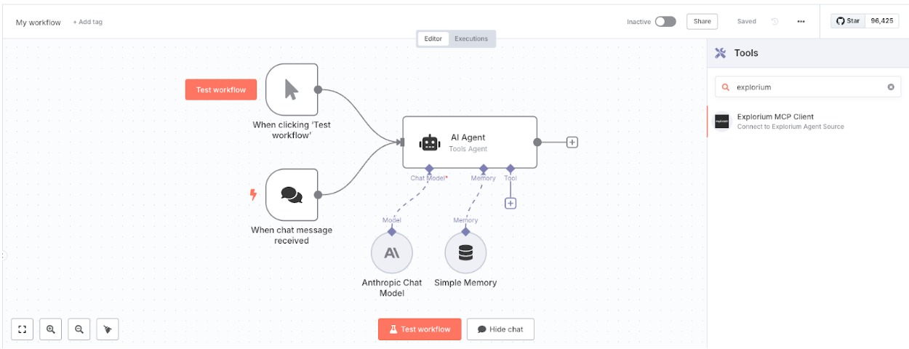
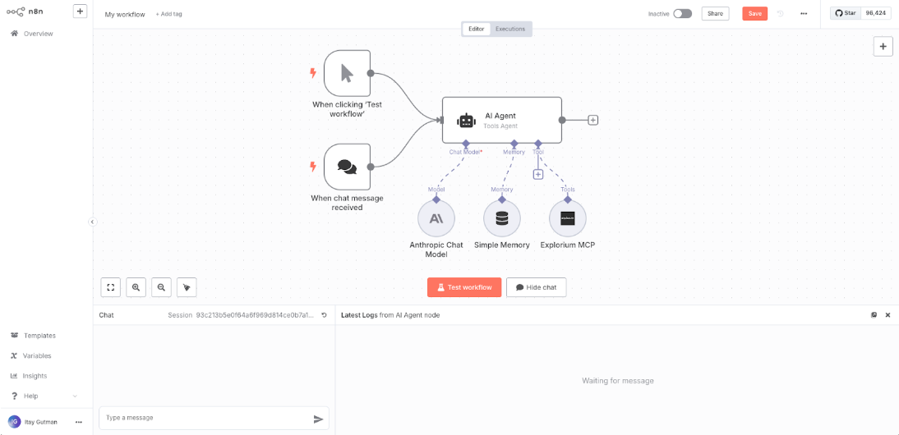
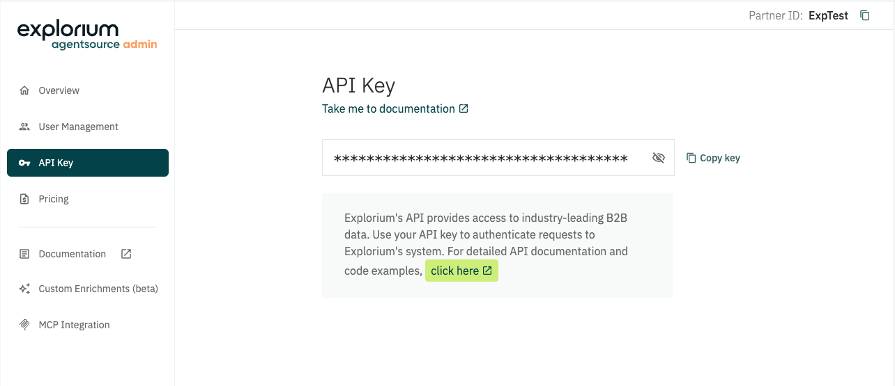

# n8n-nodes-explorium

This is an n8n community node that lets you interact with Explorium MCP (Model Context Protocol) servers in your n8n workflows with almost zero setup.

**This node can be used as a tool in n8n AI Agents**

## Installation & Use

Follow the [installation guide](https://docs.n8n.io/integrations/community-nodes/installation/) in the n8n community nodes documentation.

Also pay attention to Environment Variables for [using tools in AI Agents]

It's mandatory to set the `N8N_COMMUNITY_PACKAGES_ALLOW_TOOL_USAGE` environment variable to `true` if you want to use the Explorium MCP Client node as a tool in AI Agents.

## Credentials

This MCP Server require Explorium API Key - [Obtain your API Key](https://developers.explorium.ai/reference/quick-starts)

## Resources

* [n8n community nodes documentation](https://docs.n8n.io/integrations/community-nodes/)
* [Model Context Protocol Documentation](https://modelcontextprotocol.io/docs/)
* [Explorium Docs](https://developers.explorium.ai/)
* [AgentSource MCP](https://developers.explorium.ai/reference/agentsource-mcp)

## License

[n8n](https://n8n.io/) is a [fair-code licensed](https://docs.n8n.io/reference/license/) workflow automation platform.

This project is licensed under the MIT License - see the [LICENSE.md](LICENSE.md) file for details.
